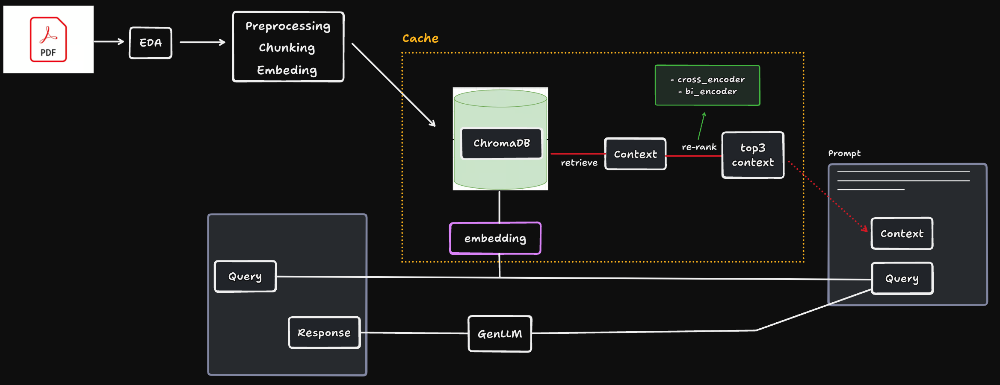

# ABOUT MR.HELPMATE AI
### Project goal
The project will aim to build a robust generative search system capable of effectively and accurately answering questions from a policy document.

You can see the project report at [HelpMate AI Project.pdf](https://docs.google.com/document/d/1vclhIc1nYeOIGrlid1F9Oyv_XhbnTGp_88Wk6WzGJio/edit?usp=sharing)
### Data source
I use a single long-life insurance policy document for this project. The PDF for the document can be downloaded at [link_to_download](https://drive.google.com/file/d/1_SJjkgTLO0xPJx8bfoRZoSMx9xVw9o0L/view?usp=sharing)

### Design choices

I implement step by step:
- Embedding Layer
- Search Layer 
- Generative Layer
- Query Search
- Compare the retrieval result from 2 methods: cross_encoder and bi_encoder

### Challenges faced
Most of the challenges are from the parameter selection. It is tough to find the chunking size, and top k retrieval documents.

When we have a lot of retrieved documents, the LLM can not find the important information to generate a good answer, besides we have a limitation of input and output tokens.

While we had fewer retrieved documents, we did not have enough pieces of information to generate the answer.

# Setup Enviroment
```bash
conda create -n rag python=3.10
conda activate rag
pip instal -r requirements.txt
```